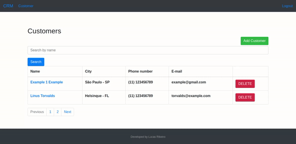

<h1 align="center">Welcome to CustomerAdministration 👋</h1>
<p>
  <a href="LISENSE" target="_blank">
    
  </a>
    
  <a href="https://twitter.com/mrlucasrib" target="_blank">
    
  </a>
</p>

> CustomerAdministration is simple customer relationship management **(CRM)**. It allows you to add, create, update, remove and list all users. Uses an authentication system 

### ✨ [Demo](https://customeradministration.herokuapp.com/customer/list/)

## :rocket: Technologies

This project was developed with the following technologies:

- 
- 
- 
- 

## 💻 Project Screen



## :information_source: How To Use

### Prerequisites
- Python 3
- Pipenv
- PostegreSQL or SQLite (configure on `settings.py`)
### Usage
From your command line:

```sh
# Clone repository
git clone https://github.com/mrlucasrib/CustomerAdministration.git
cd CustomerAdministration
pipenv install
pipenv run python manage.py collectstatic
pipenv run db
pipenv run dev
```

## Author

👤 **Lucas Ribeiro**

* Twitter: [@mrlucasrib](https://twitter.com/mrlucasrib)
* Github: [@mrlucasrib](https://github.com/mrlucasrib)
* LinkedIn: [mrlucasrib](https://linkedin.com/in/mrlucasrib)

## :memo: License

This project is under the AGPL v3 license. See the [LICENSE](LICENSE) for details.

## Show your support

Give a ⭐️ if you liked this project!
